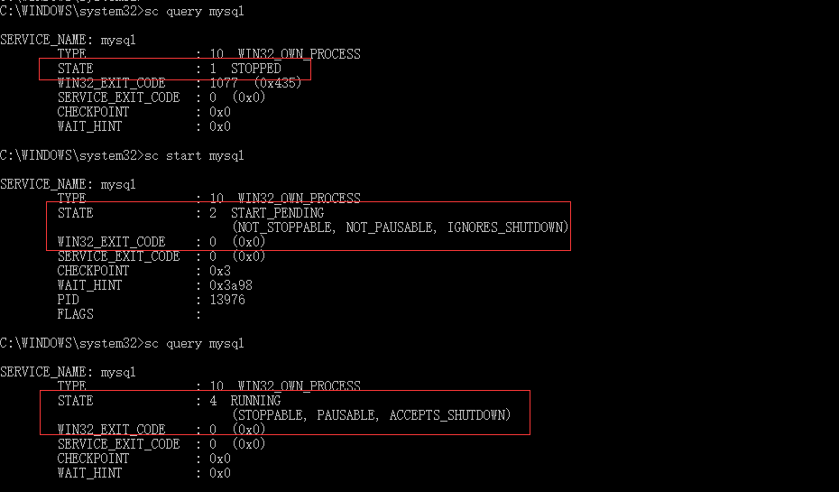

# Learn-SpringMVC
Learn-SpringMVC
## ```Windows10```MySQL免安装版配置教程
* 解压下载的文件

* 修改环境变量

* 修改配置文件


* 安装服务
```txt
安装服务 mysqld install 服务名字(mysql) --defaults-file="D:\mysql-5.7.10-winx64\my.ini"
移除服务 mysqld remove
查看服务 winpty sc query mysql
```
* 执行 MySQL 初始化命令，在 MySQL 目录下生成 data 文件夹 ```mysqld --initialize --user=mysql  --console```

* 启动服务，登录数据库修改密码```alter user 'root'@'localhost' identified by 'root';```
```txt
启动服务 winpty net start mysql
启动服务 winpty sc start mysql
```


* 登录命令
```txt
winpty mysql -u root -p
winpty mysql --host=127.0.0.1 --user=root --password
winpty mysql --host="127.0.0.1" --user=root --password
winpty mysql --host=localhost --user=root --password
mysql -uroot -proot
```
* 查询用户信息```select `Host`,`User`,`password_expired`,`password_last_changed`,`password_lifetime` from mysql.user;```

* 基本操作
```txt
create database harrdy1028;
show databases;
#删除数据库
drop database harrdy2018; 

create table `student_AA`(`student_id` int,`name` varchar(20),`major` varchar(20),primary key(`student_id`));

# 增加约束
create table `student`(`student_id` int,`name` varchar(20) not null,`major` varchar(20) unique,`hobby` varchar(10) default '吃',primary key (`student_id`));

# 自动加
create table `student`(`student_id` int auto_increment,`name` varchar(20),`major` varchar(20),primary key(`student_id`));

create table student(student_id int primary key,name varchar(20),major varchar(20));
describe student;
# 删表
drop table student; 
```
