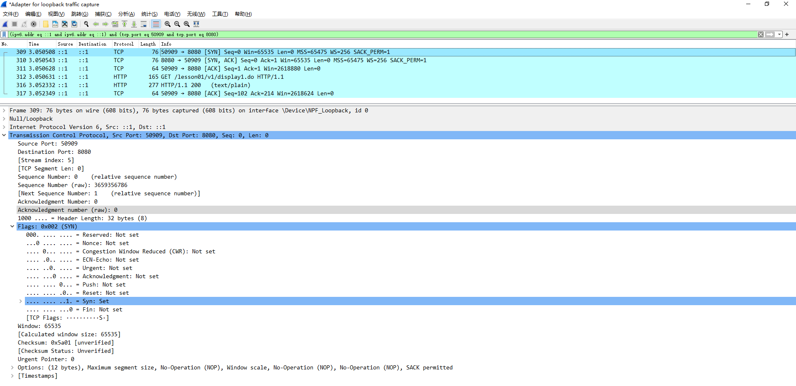
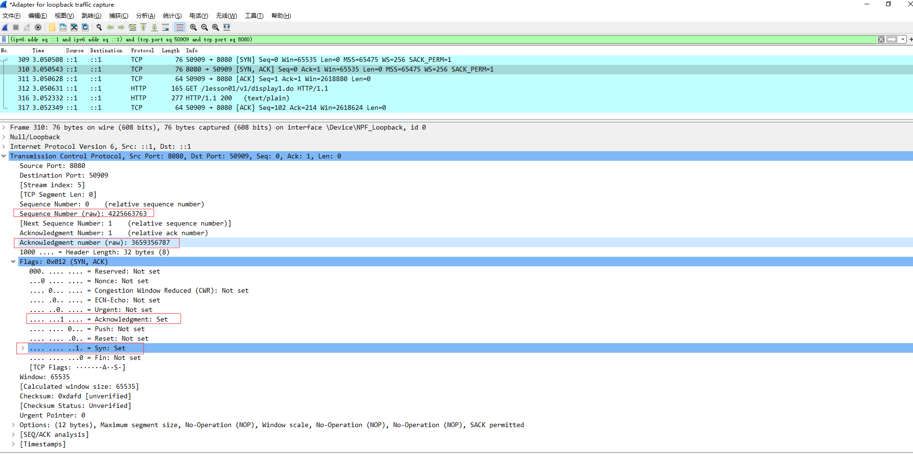
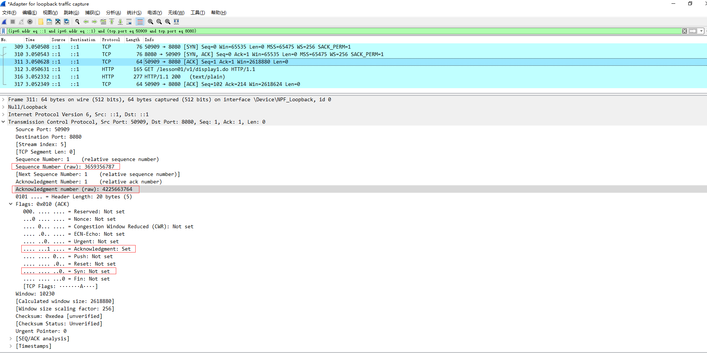
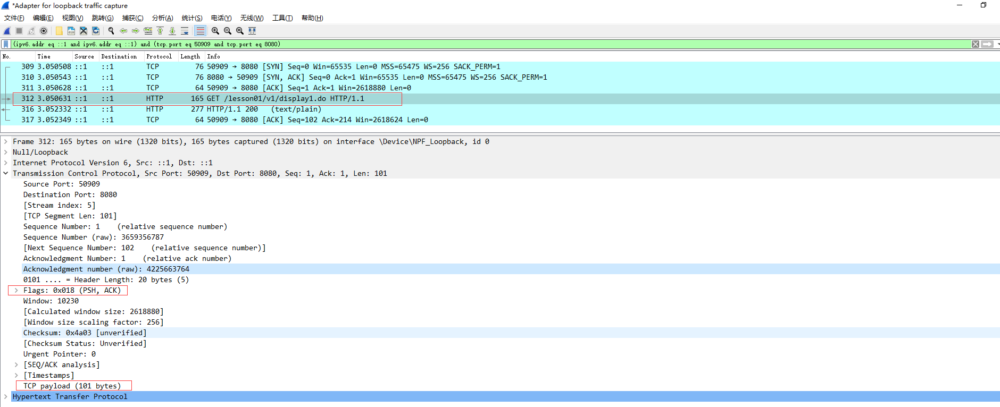
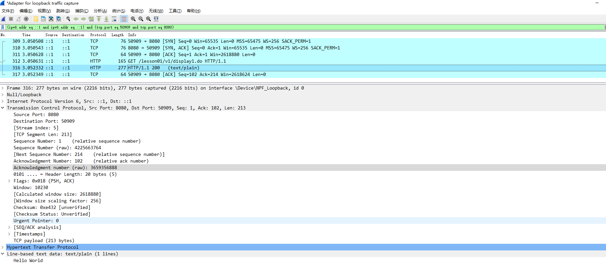
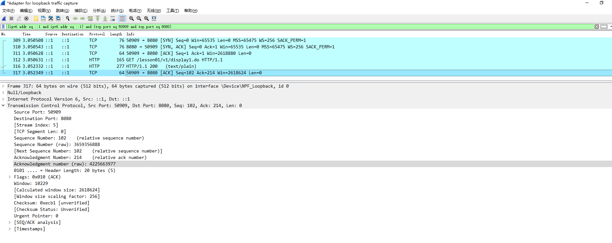

### TCP过程
#### 客户端发起请求```http://localhost:8080/lesson01/v1/display1.do```
* 第一次握手
```txt
客户端给服务器发一个包
SYN=1 ACK=0
随机的一个序列化 Sequence Number (raw): 3659356786
确认号         Acknowledgment number (raw): 0
```

* 第二次握手
```txt
服务器给客户端回包
SYN=1 ACK=1
随机的一个序列化 Sequence Number (raw): 4225663763
确认号         Acknowledgment number (raw): 3659356787 告诉客户端你的下一个序列号从这个数开始
```

* 第三次握手
```txt
客户端回包
SYN=0 ACK=1
Sequence Number (raw): 3659356787
Acknowledgment number (raw): 4225663764 告诉服务端你的序列号从这个数开始
```

* 握手完成数据传输
```txt
客户端发起请求
PSH=1 ACK=1
Sequence Number (raw): 3659356787
Acknowledgment number (raw): 4225663764 告诉服务端你的序列号从这个数开始
注意TCP负载 101Bytes
```

* 服务器响应请求
```txt
服务端响应Hello World
PSH=1 ACK=1
Sequence Number (raw): 4225663764
Acknowledgment number (raw): 3659356787+101=3659356888 告诉客户端你的序列号从这个数开始
注意TCP负载 213Bytes
```

* 客户端收到服务端的响应后回复
```txt
ACK=1
Sequence Number (raw): 3659356888
Acknowledgment number (raw): 4225663764+213=4225663977 告诉服务端你的序列号从这个数开始
```

