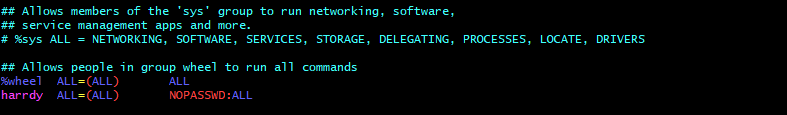
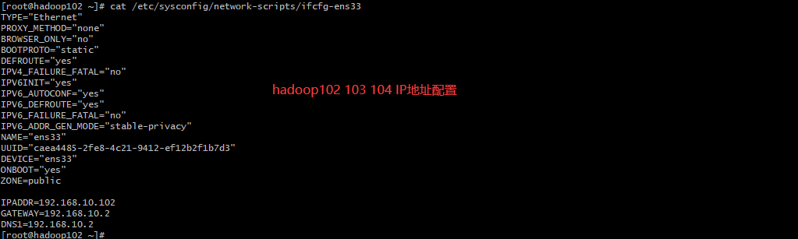
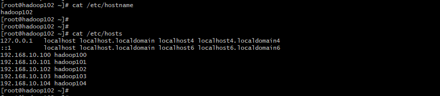

### 虚拟机环境准备
```sh
# 工具包合集
yum install -y net-tools
# 编辑器
yum install -y vim
# 软件仓库 Extra Packages for EnterPrise Linux
yum install -y epel-release
# 关闭防火墙 关闭防火墙开机自启动
systemctl stop firewalld
systemctl disable firewalld.service
# 创建harrdy用户
useradd harrdy
passwd harrdy  # centos
```
### 配置用户权限

```txt
# 创建目录和文件夹
mkdir /opt/module
mkdir /opt/software
# 更改文件的所有者和所属组
[root@hadoop100 opt]# chown harrdy:harrdy /opt/module/
[root@hadoop100 opt]# chown harrdy:harrdy /opt/software/
```
### 卸载虚拟机自带的JDK
```txt
[root@hadoop100 opt]# rpm -qa | grep -i java | xargs -n1 rpm -e --nodeps
rpm -qa 查询所有包
grep -i 忽略大小写
rpm -e --nodeps 强制卸载软件
```
### 克隆并配置


