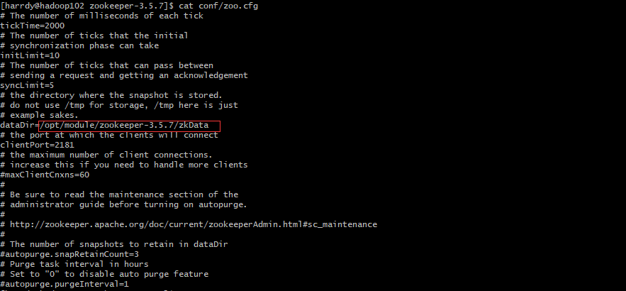

### Zookeeper安装
```txt
tar -zxvf /opt/module/software/apache-zookeeper-3.5.7-bin.tar.gz -C /opt/module/
[harrdy@hadoop102 module]$ mv apache-zookeeper-3.5.7-bin/ zookeeper-3.5.7
```
### 修改配置文件

```shell
## 启动
[harrdy@hadoop102 zookeeper-3.5.7]$ bin/zkServer.sh start
## 查看进程是否启动
jps
## 查看状态
[harrdy@hadoop102 zookeeper-3.5.7]$ bin/zkServer.sh status
## 启动客户端
[harrdy@hadoop102 zookeeper-3.5.7]$ bin/zkCli.sh
## 退出客户端
quit
## 停止Zookeeper
[harrdy@hadoop102 zookeeper-3.5.7]$ bin/zkServer.sh stop
```
