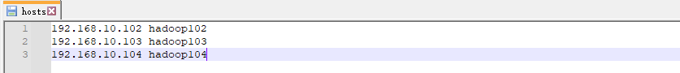

### Zookeeper链接操作
* 本机设置好域名映射

* idea操作
```xml
<dependency>
    <groupId>org.apache.zookeeper</groupId>
    <artifactId>zookeeper</artifactId>
    <version>3.5.7</version>
</dependency>
```
```java
package com.test;

import org.apache.zookeeper.*;
import org.apache.zookeeper.data.Stat;

import java.io.IOException;

class DefaultWatcher implements Watcher {

    @Override
    public void process(WatchedEvent watchedEvent) {
        System.out.println("=============DefaultWatcher start==============");
        System.out.println("DefaultWatcher state: "+watchedEvent.getState().name());
        System.out.println("DefaultWatcher type: "+watchedEvent.getType().name());
        System.out.println("DefaultWatcher path: "+watchedEvent.getPath());
        System.out.println("=============DefaultWatcher end==============");
    }
}

class ChildrenWatcher implements Watcher {

    @Override
    public void process(WatchedEvent watchedEvent) {
        System.out.println("=============ChildrenWatcher start==============");
        System.out.println("ChildrenWatcher state: "+watchedEvent.getState().name());
        System.out.println("ChildrenWatcher type: "+watchedEvent.getType().name());
        System.out.println("ChildrenWatcher path: "+watchedEvent.getPath());
        System.out.println("=============ChildrenWatcher end==============");
    }
}

class DataWatcher implements Watcher {

    @Override
    public void process(WatchedEvent watchedEvent) {
        System.out.println("=============DataWatcher start==============");
        System.out.println("DataWatcher state: "+watchedEvent.getState().name());
        System.out.println("DataWatcher type: "+watchedEvent.getType().name());
        System.out.println("DataWatcher path: "+watchedEvent.getPath());
        System.out.println("=============DataWatcher end==============");
    }
}

public class ZKclient {
    private static ZooKeeper zkClient = null;
    private static String connectString = "hadoop102:2181,hadoop103:2181,hadoop104:2181";
    private static int sessionTimeout = 5000;
    private static DefaultWatcher defaultWatcher = new DefaultWatcher();
    private static ChildrenWatcher childrenWatcher = new ChildrenWatcher();
    private static DataWatcher dataWatcher = new DataWatcher();

    static {
        try {
            zkClient = new ZooKeeper(connectString, sessionTimeout, defaultWatcher);
        } catch (IOException e) {
            throw new RuntimeException(e);
        }
    }

    public static void main(String[] args) {
        try {
            Stat stat = zkClient.exists("/harrdy", false);
            if (stat == null) {
                zkClient.create("/harrdy", "ss.avi".getBytes(), ZooDefs.Ids.OPEN_ACL_UNSAFE, CreateMode.PERSISTENT);
            } else {
                System.out.println(stat);
                // zkClient.getChildren("/harrdy", true);
                zkClient.getChildren("/harrdy", childrenWatcher);
                zkClient.getData("/harrdy", dataWatcher, null);
            }
            Thread.sleep(Long.MAX_VALUE);
        } catch (InterruptedException e) {
            throw new RuntimeException(e);
        } catch (KeeperException e) {
            throw new RuntimeException(e);
        }
    }
}
```
