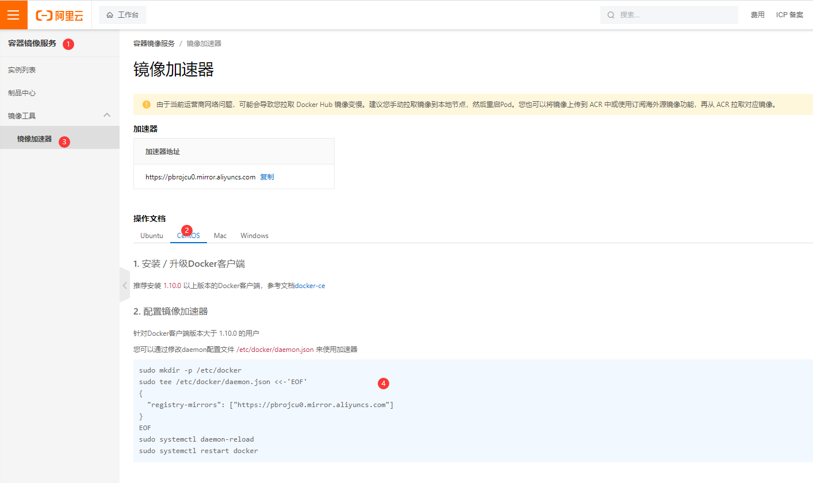

## docker学习
### 概念
```txt
镜像(image)

容器(container)
通过镜像创建容器
启动、停止、删除

仓库(repository)
存放镜像的地方
仓库分为公有仓库和私有仓库，默认是国外的，要配置镜像加速
```
### 安装docker
```shell
# 帮助文档
https://docs.docker.com/engine/install/centos/

# 卸载老的版本
sudo yum remove docker \
                  docker-client \
                  docker-client-latest \
                  docker-common \
                  docker-latest \
                  docker-latest-logrotate \
                  docker-logrotate \
                  docker-engine

# 安装工具包和设置仓库地址
sudo yum install -y yum-utils
# /etc/yum.repos.d/目录下加了repo仓库 不要走国外的镜像，走阿里云镜像
sudo yum-config-manager --add-repo https://download.docker.com/linux/centos/docker-ce.repo
sudo yum-config-manager --add-repo http://mirrors.aliyun.com/docker-ce/linux/centos/docker-ce.repo

# 更新yum软件包索引
yum makecache fast

# 安装docker相关
sudo yum install docker-ce docker-ce-cli containerd.io

# 启动docker
sudo systemctl start docker
sudo systemctl status docker

# 测试 刚开始没有镜像，他会去拉镜像
sudo docker run hello-world
```
### 配置阿里云镜像加速器

```shell
sudo mkdir -p /etc/docker
sudo tee /etc/docker/daemon.json <<-'EOF'
{
  "registry-mirrors": ["https://pbrojcu0.mirror.aliyuncs.com"]
}
EOF
sudo systemctl daemon-reload
sudo systemctl restart docker
```
### 部署安装nginx
```shell
# 搜索镜像
docker search nginx

# 拉取镜像
docker pull nginx

# 查看下载的镜像
docker images

# 通过镜像创建并运行一个新的容器(后台启动，主机暴露端口3344)
docker run -d --name nginx01 -p 3344:80 nginx

# 查看容器
docker ps
docker ps -a

# 进容器
docker exec -it nginx01 /bin/bash

# 退出容器不删除
Ctrl+P+Q

# 删除容器
docker rm <容器>
```
### 部署tomcat
```shell
docker run -d --name tomcat01 -p 3355:8080 tomcat:9.0

## 官方的tomcat版本是阉割过的，没有webapps 进入容器 
cp -r /usr/local/tomcat/webapps.dist/* /usr/local/tomcat/webapps/
```
### 容器数据卷
```shell
# 数据不应该放在容器中，数据可以持久化,数据共享
# 如果目录不存在宿主机和容器都会创建,同步双向进行
[root@k8smaster ~]# docker run -it -d --name centos02 -v /home/cheshi:/home/chesirongqi centos
[root@k8smaster ~]# docker exec -it centos02 /bin/bash
# 查看数据卷
[root@k8smaster cheshi]# docker inspect centos02
 "Mounts": [
            {
                "Type": "bind",
                "Source": "/home/cheshi",
                "Destination": "/home/chesirongqi",
                "Mode": "",
                "RW": true,
                "Propagation": "rprivate"
            }
        ]

```
### DockerFile
```DockerFile
[root@k8smaster dockerfiletest]# cat dockerfile01
FROM centos
VOLUME ["volume01","volume02"]
CMD echo "------end------------"
CMD /bin/bash

[root@k8smaster dockerfiletest]# docker build -f /opt/software/dockerfiletest/dockerfile01 -t learn/dockerfile01:1.0 .

[root@k8smaster dockerfiletest]# docker images
REPOSITORY                                                        TAG        IMAGE ID       CREATED         SIZE                                                          latest     fb5657adc892   18 months ago   680MB
learn/dockerfile01                                                1.0        820998e49abc   21 months ago   231MB

# 查看镜像详情
[root@k8smaster dockerfiletest]# docker inspect 镜像ID

# 创建容器
[root@k8smaster dockerfiletest]# docker run -it -d --name myowncon learn/dockerfile01:1.0
d12f6b11d6718226bdcfe662f5f9cf149fc4c4b3f57063ebae44b7d2e7f26e22

# 查看容器
[root@k8smaster dockerfiletest]# docker ps
CONTAINER ID   IMAGE                                               COMMAND                  CREATED          STATUS          PORTS                    NAMES
d12f6b11d671   learn/dockerfile01:1.0                              "/bin/sh -c /bin/bash"   33 seconds ago   Up 32 seconds                            myowncon

# 进入容器 无伤退出容器ctrl+P+Q  新建了 volume01  volume02 两个目录
[root@k8smaster dockerfiletest]# docker exec -it d12f6b11d671 /bin/bash
[root@k8smaster dockerfiletest]# docker attach d12f6b11d671
[root@d12f6b11d671 /]# ls
bin  dev  etc  home  lib  lib64  lost+found  media  mnt  opt  proc  root  run  sbin  srv  sys  tmp  usr  var  volume01  volume02

# 查看容器详情
[root@k8smaster dockerfiletest]# docker inspect d12f6b11d671
 "Mounts": [
            {
                "Type": "volume",
                "Name": "79ddf1d5b1001573d85f6ce67c96d552acb8861e105f8471fd40e698dbacde9a",
                "Source": "/var/lib/docker/volumes/79ddf1d5b1001573d85f6ce67c96d552acb8861e105f8471fd40e698dbacde9a/_data", # 宿主机目录
                "Destination": "volume02", # 容器里面目录
                "Driver": "local",
                "Mode": "",
                "RW": true,
                "Propagation": ""
            },
            {
                "Type": "volume",
                "Name": "3cc2bee757bfe2ac13bcd35464376e63ef8783bd4d5d2234ea12d3e0f883b2a8",
                "Source": "/var/lib/docker/volumes/3cc2bee757bfe2ac13bcd35464376e63ef8783bd4d5d2234ea12d3e0f883b2a8/_data",
                "Destination": "volume01",
                "Driver": "local",
                "Mode": "",
                "RW": true,
                "Propagation": ""
            }
        ]
```
### 自定义tomcat版本的Dockerfile
* 名字命名为```Dockerfile```比较好```docker build -t diytomcat .```
```dockerfile
FROM centos
MAINTAINER harrdy<995122077@qq.com>

COPY readme.txt /usr/local/readme.txt
ADD  jdk-8u341-linux-x64.tar.gz /usr/local
ADD  apache-tomcat-9.0.76.tar.gz /usr/local

ENV MYPATH /usr/local
## 进入容器显示的目录
WORKDIR $MYPATH

ENV JAVA_HOME /usr/local/jdk1.8.0_341
ENV CLASSPATH $JAVA_HOME/lib/dt.jar:$JAVA_HOME/lib/tools.jar
ENV CATALINA_HOME /usr/local/apache-tomcat-9.0.76
ENV CATALINA_BASE /usr/local/apache-tomcat-9.0.76
ENV PATH $PATH:$JAVA_HOME/bin:$CATALINA_HOME/lib:$CATALINA_HOME/bin/

EXPOSE 8080

CMD /usr/local/apache-tomcat-9.0.76/bin/startup.sh && tail -F /usr/local/apache-tomcat-9.0.76/bin/logs/catalina.out
```
* 容器启动
```shell
[root@k8smaster dockerfiletest]# docker images
REPOSITORY                                                        TAG        IMAGE ID       CREATED          SIZE
diytomcat                                                         latest     f854d3b7c1d2   30 minutes ago   617MB

# 端口映射 tomcat启动404注意查看webapps下面有没有文件
docker run -it -d --name tomcattest02 -p 9090:8080 \ 
-v /home/harrdydocker/build/tomcat/webapps:/usr/local/apache-tomcat-9.0.76/webapps \
-v /home/harrdydocker/build/tomcat/logs:/usr/local/apache-tomcat-9.0.76/logs \
diytomcat

[root@k8smaster tomcat]# docker ps
CONTAINER ID   IMAGE                                               COMMAND                  CREATED              STATUS              PORTS                    NAMES
93e8063963b6   diytomcat                                           "/bin/sh -c '/usr/lo…"   About a minute ago   Up About a minute   0.0.0.0:9090->8080/tcp   tomcattest02

# 进入容器 docker attach 方式进入容器容易卡住
[root@k8smaster dockerfiletest]# docker exec -it tomcattest02 /bin/bash
```