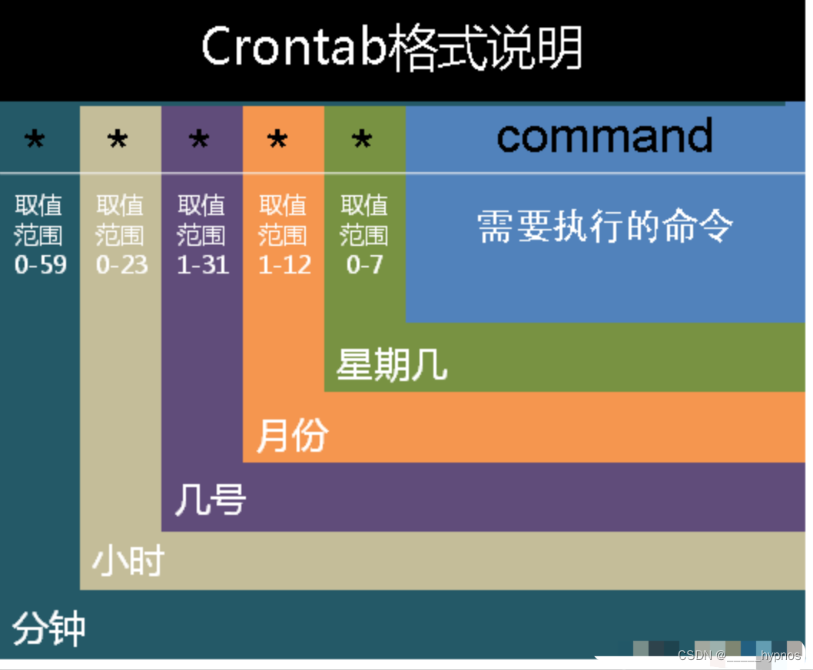

### iptables
#### 安装
```shell
## 解决出现Unit iptables.service could not be found错误
yum install -y iptables ## 这个一般都会有
yum install iptables-services

## 查看状态
systemctl status iptables
service iptables status

## 开机自启动
systemctl enable iptables

## 保存
[root@hadoop103 tmp]# service iptables save
iptables: Saving firewall rules to /etc/sysconfig/iptables:[  OK  ]
## 或者保存
iptables-save > /etc/sysconfig/iptables
```
#### ```iptables```端口转发实现
```txt
## 环境信息
192.168.10.1 ## windows
192.168.10.103 ## 要在这个服务器上实现端口转发
192.168.10.102 ## 开启80 httpd服务

# 示例1：将本地的8000端口转发到本机的80端口
# 假设我们有一台服务器，IP地址为192.168.10.102，端口号为80，而我们希望将本地的8000端口转发到这个服务器的80端口。
# http://192.168.10.102:80/ 这是可以访问的，但是我要这样访问 http://192.168.10.102:8000/
# 在本地终端设置iptables规则，实现8000端口转发到80端口

# -t nat表示规则类型是nat
# -A PREROUTING表示添加到PREROUTING规则链
# -p tcp表示TCP协议
# --dport表示目的端口号
# -j 处理的行文 [DNAT/SNAT/ACCPET接收/DROP丢弃/REJECT拒绝]
# --to-destination表示目标IP地址和端口号
iptables -t nat -A PREROUTING -p tcp --dport 8000 -j DNAT --to-destination 192.168.10.102:80
iptables -t nat --list -n -v
iptables -t filter --list -n -v
iptables -t filter --delete FORWARD 1
iptables -t filter --delete INPUT 5
# 保存iptables规则
iptables-save > /etc/sysconfig/iptables


# 示例2：将本地的8000端口转发到远程机器的80端口
# 假设我们有一台服务器，IP地址为192.168.10.102，端口号为80，而我们希望将本地的8000端口转发到这个服务器的80端口
# 在本地终端设置iptables规则，实现8000端口转发到192.168.10.102的80端口
iptables -t nat -A PREROUTING -p tcp --dport 8000 -j DNAT --to-destination 192.168.10.102:80
# 为转发请求指明请求来源
iptables -t nat -A POSTROUTING -p tcp -d 192.168.10.102 --dport 80 -j SNAT --to-source 192.168.10.103
# 保存iptables规则
iptables-save > /etc/sysconfig/iptables
#############TCP通信过程##################
# 192.168.10.1 浏览器上面输入 http://192.168.10.103:8000/
# TCP三次握手
192.168.10.1:49647--发送[SYN]--192.168.10.103:8000
192.168.10.103:49647--发送[SYN]--192.168.10.102:80 ## PREROUTING[DNAT] 192.168.10.1:49647--发送[SYN]--192.168.10.102:80
                                                  ## POSTROUTING[SNAT] 192.168.10.103:49647--发送[SYN]--192.168.10.102:80

192.168.10.102:80--发送[SYN,ACK]--192.168.10.103:49647
192.168.10.103:8000--发送[SYN,ACK]--192.168.10.1:49647 ## POSTROUTING[SNAT恢复] 192.168.10.102:80--发送[SYN,ACK]--192.168.10.1:49647
                                                      ## PREROUTING[DNAT恢复]  192.168.10.103:8000--发送[SYN,ACK]--192.168.10.1:49647

192.168.10.1:49647--发送[ACK]--192.168.10.103:8000
192.168.10.103:49647--发送[ACK]--192.168.10.102:80

# 发送HTTP GET报文
192.168.10.1:49647--发送[HTTP GET]--192.168.10.103:8000
192.168.10.103:49647--发送[HTTP GET]--192.168.10.102:80

# HTTP响应报文
192.168.10.102:80--发送[HTTP RESP]--192.168.10.103:49647
192.168.10.103:8000--发送[HTTP RESP]--192.168.10.1:49647
########################################
```
#### iptables全局报文流向图

#### iptables全局报文流向图
```shell
# 有一点瑕疵
# NAT表有4链 Chain PREROUTING/Chain INPUT/Chain OUTPUT/Chain POSTROUTING
NIC(Network Interface Card 网络接口卡、网卡)
```

#### 使用规则

#### redis如果远程登录需要放行端口
```txt
# 列举filter表
iptables -t filter -L

# 不指定表默认代表filter
# -I 默认插入在最前面
# -p 协议
# --dport 目的端口
# -j 动作
iptables -I INPUT -p tcp --dport 6379 -j ACCEPT

[root@left ~]# iptables -t filter -L
Chain INPUT (policy ACCEPT)
target     prot opt source               destination
ACCEPT     tcp  --  anywhere             anywhere             tcp dpt:6379
```
#### linux上自由切换用户
```sh
# harrdy切换到root用户并执行
[harrdy@left root]$ echo "centos" | su - root -c /home/harrdy/development/hello.sh
Password: Hello World!

# 希望屏蔽 标准输出 /dev/null 是一个特殊的文件，写入到它的内容都会被丢弃；如果尝试从该文件读取内容，那么什么也读不到
[harrdy@left root]$ echo "centos" | su - root -c /home/harrdy/development/hello.sh > /dev/null
Password:

# 屏蔽标准输出和标准错误输出
echo "centos" | su - root -c /home/harrdy/development/hello.sh > /dev/null 2>&1
```
### crontab定时任务

```
yum install crontabs 下载安装
service crond status 查看crontab服务状态
service crond start 手动启动crontab服务
crontab -l 查看定时任务列表
crontab –e 编辑/添加定时任务

# 日志查看
[root@left ~]# tail -f /var/log/cron
May 30 05:24:01 left CROND[7791]: (root) CMD (echo "Hello Wolrd!!!!")
May 30 05:24:01 left CROND[7792]: (harrdy) CMD (echo "centos" | su - root -c /home/harrdy/development/hello.sh)
May 30 05:25:01 left CROND[7846]: (root) CMD (echo "Hello Wolrd!!!!")
May 30 05:25:01 left CROND[7847]: (harrdy) CMD (echo "centos" | su - root -c /home/harrdy/development/hello.sh)
```
