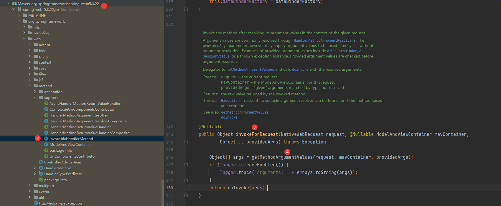
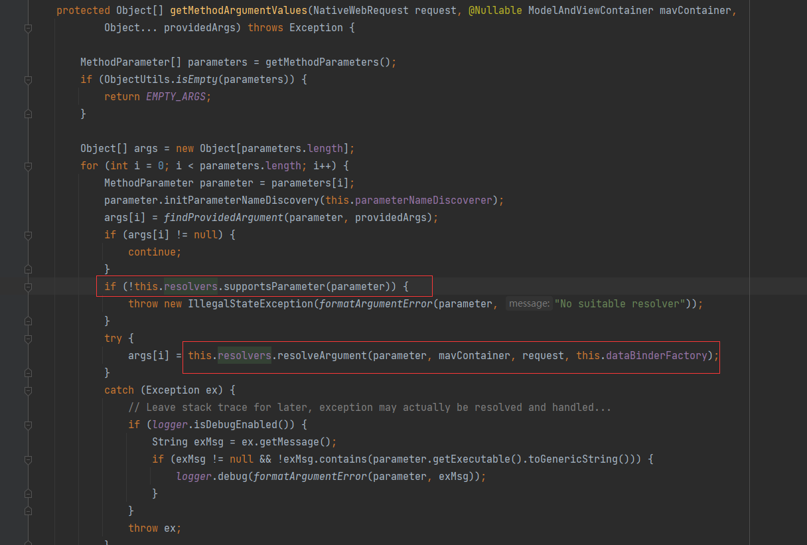
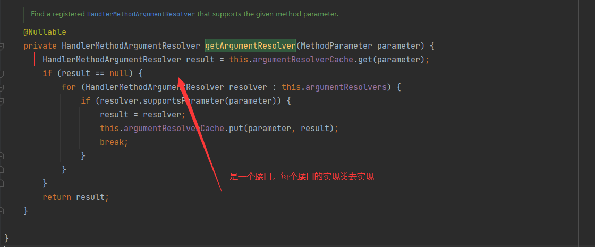
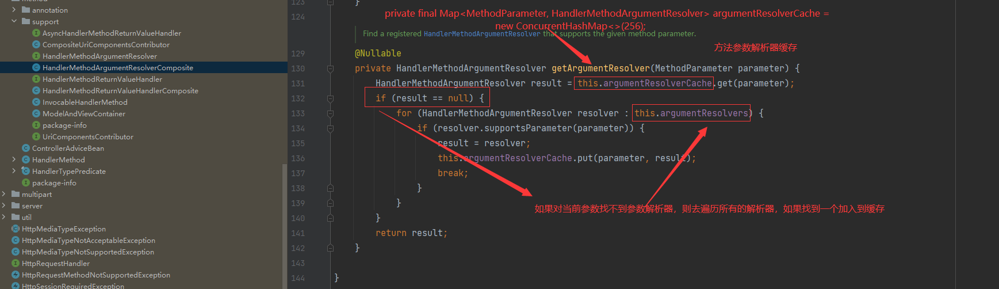
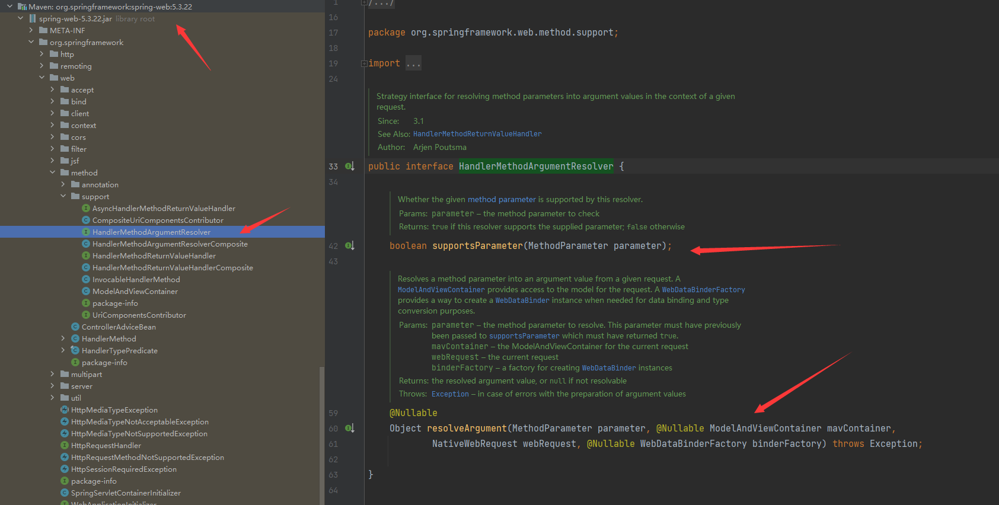
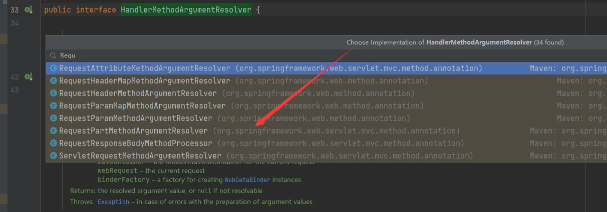

## lesson02
### 参数解析逻辑



* 参数解析缓存的应用
---

### ```org.springframework.web.method.support.HandlerMethodArgumentResolver```接口


### ```@RequestHeader```注解用法
```shell
# RequestHeader 对应的解析器为RequestHeaderMethodArgumentResolver

# org.springframework.web.method.annotation.RequestHeaderMethodArgumentResolver.supportsParameter
	@Override
	public boolean supportsParameter(MethodParameter parameter) {
	  # 判断参数是否为RequestHeader注解标记，并且类型不为map
		return (parameter.hasParameterAnnotation(RequestHeader.class) &&
				!Map.class.isAssignableFrom(parameter.nestedIfOptional().getNestedParameterType()));
	}

# org.springframework.web.method.annotation.AbstractNamedValueMethodArgumentResolver.resolveArgument
```
### ```Controller```里面的参数类型与解析器的对应关系
|       参数类型       |                参数解析器                |
|:----------------:|:-----------------------------------:|
| @RequestHeader注解 | RequestHeaderMethodArgumentResolver |
|  @RequestBody注解  | RequestResponseBodyMethodProcessor  |


