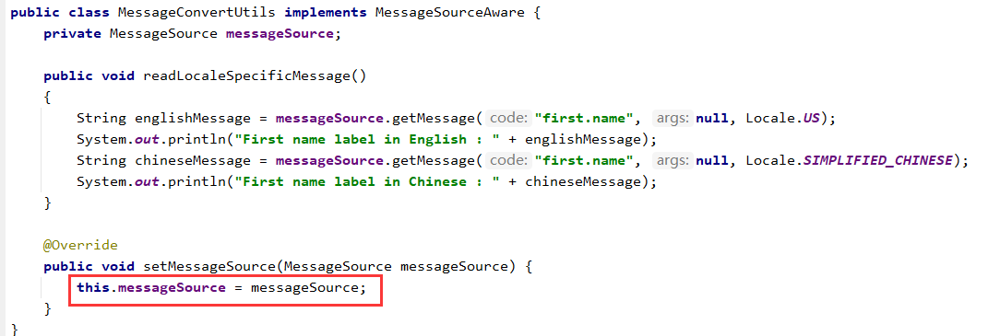
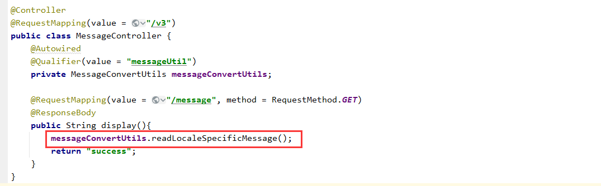

### lesson03
* ```EmployeeController.java```
```shell
# validator
# PathVariable注解&ModelAttribute注解
```
* ```Employee2Controller.java```
```shell
# RequestParam注解
# RequestBody注解
```
* ```StudentController.java```
```xml
    <!-- 使用注解方式验证java bean -->
    <!-- javax.validation.validation-api JSR-303批注装饰Java bean -->
    <!--  验证器的一个实现，例如Hibernate Validator -->
    <dependency>
      <groupId>org.hibernate</groupId>
      <artifactId>hibernate-validator</artifactId>
      <version>5.4.1.Final</version>
    </dependency>
```
```json
 {
  "studentId": 1000,
  "sName": "",
  "grades": [
  ],
  "subjects": [
    "math",
    "chinese"
  ]
}
```
#### ```MessageSourceAware```
* 使用场景:项目启动时不同环境加载不同的配置
* 加载bean告诉文件具体位置
```xml
<bean id="messageSource" class="org.springframework.context.support.ResourceBundleMessageSource">
        <property name="basenames">
            <list>
                <value>messages</value>
            </list>
        </property>
</bean>
```
* 实现MessageSourceAware接口
---

* 加载bean
```xml
<bean id="messageUtil" class="util.MessageConvertUtils"></bean>
```
* 构造请求```controller```
---


