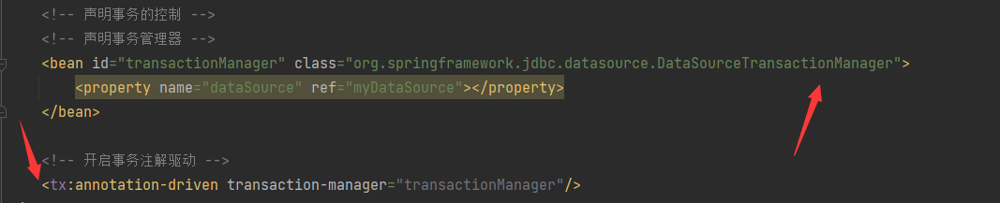

## lesson05
* 阿里中间件```druid```
* ```MyBatis```
#### 事物例子
* 创建表```sale```
```mysql
drop table if exists `sale`;
create table `sale`
(`id` int auto_increment,
`gid` int,
`num` int,
primary key(`id`)) ENGINE=InnoDB DEFAULT CHARSET=utf8mb4;
```
* 创建商品表```goods```
```mysql
drop table if exists `goods`;
create table `goods`
(`id` int,
`name` varchar(100),
`amount` int,
`price` float,
primary key(`id`)) ENGINE=InnoDB DEFAULT CHARSET=utf8mb4;

insert into `goods`(`id`,`name`,`amount`,`price`) values(1001,'笔记本',10,15);
insert into `goods`(`id`,`name`,`amount`,`price`) values(1002,'手机',20,3000);
```
#### 配置```MyBatis```坑
* 文件要同名
---

#### 启动事物
* 更改配置文件
---

* 添加注解
---

#### 解释```rollbackFor```
```txt
1)框架首先检查方法抛出的异常是不是在rollbackFor数组中，如果在一定回滚
2)如果方法抛出的异常不在rollbackFor数组中，框架会继续检查抛出的异常是不是RuntimeException,如果是一定回滚
```
---

