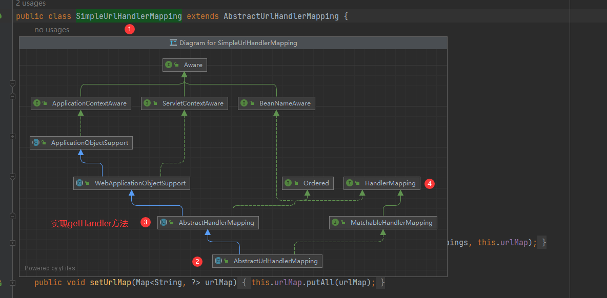
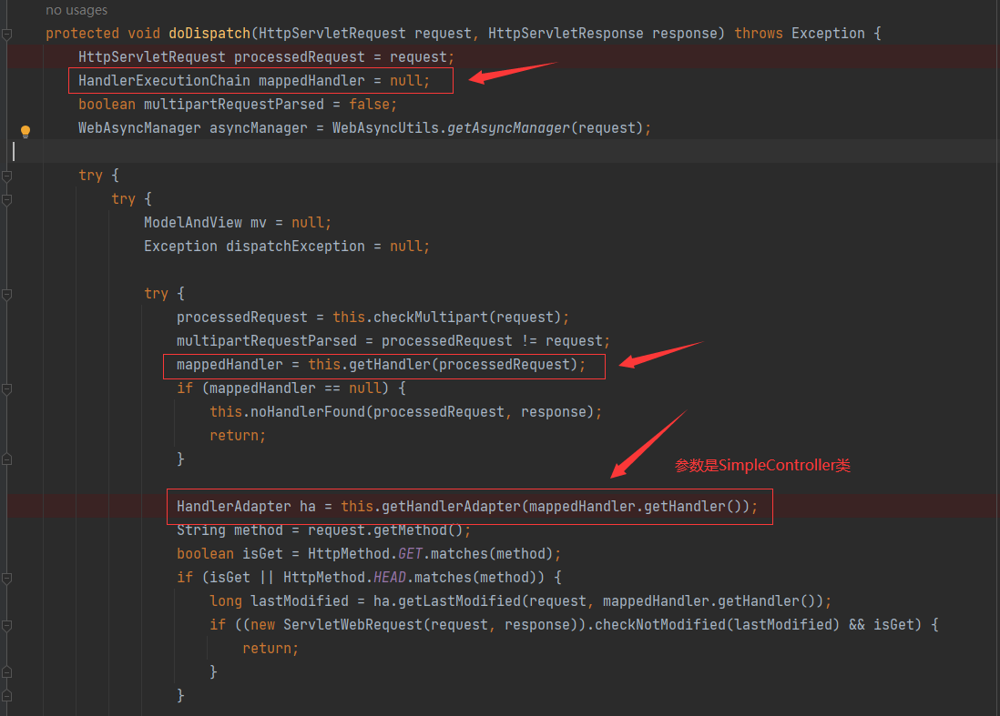
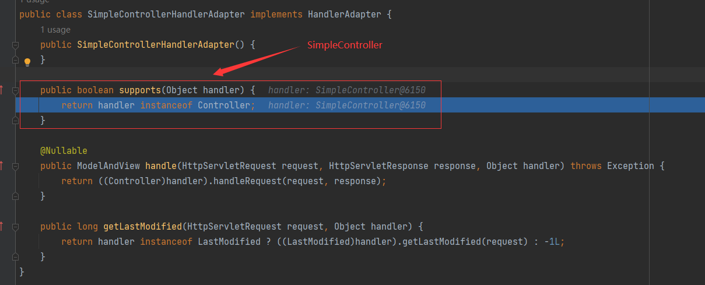
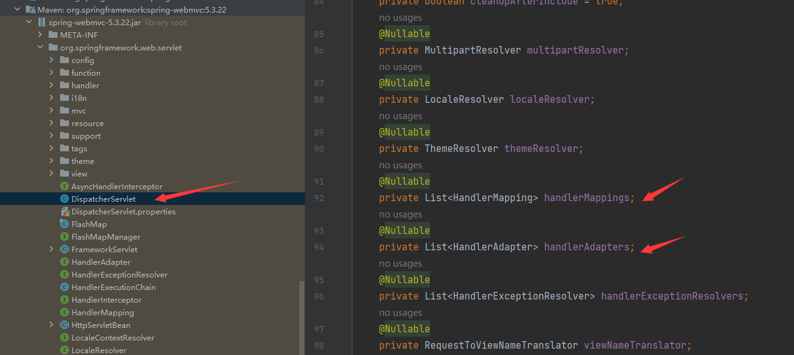
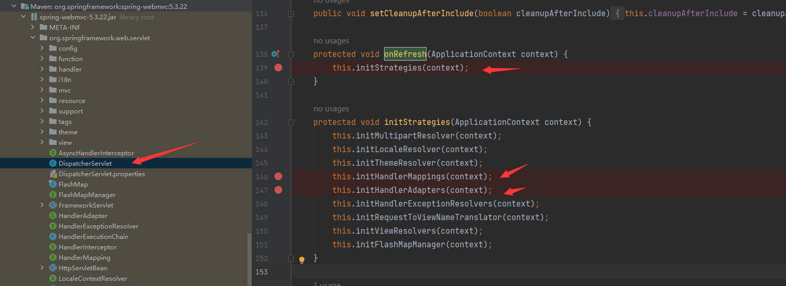

## lesson12
### HandleMapping接口
```java
// HandlerMapping类
public interface HandlerMapping {
    @Nullable
    HandlerExecutionChain getHandler(HttpServletRequest request) throws Exception;
}


// 返回HandlerExecutionChain类
public class HandlerExecutionChain {
    // 处理器对象
    private final Object handler;

    // 拦截器数组
    private final List<HandlerInterceptor> interceptorList;
    
    // 拦截器位置
    private int interceptorIndex;
}

// HandlerInterceptor拦截器接口
public interface HandlerInterceptor {
    default boolean preHandle(HttpServletRequest request, HttpServletResponse response, Object handler) throws Exception {
        return true;
    }

    default void postHandle(HttpServletRequest request, HttpServletResponse response, Object handler, @Nullable ModelAndView modelAndView) throws Exception {
    }

    default void afterCompletion(HttpServletRequest request, HttpServletResponse response, Object handler, @Nullable Exception ex) throws Exception {
    }
}
```
### HandleMapping接口实现类
* ```org.springframework.web.servlet.handler.SimpleUrlHandlerMapping```

---
* 请求进来执行过程

---
* 合适适配器的依据

---
* 映射器和适配器初始化流程

---


