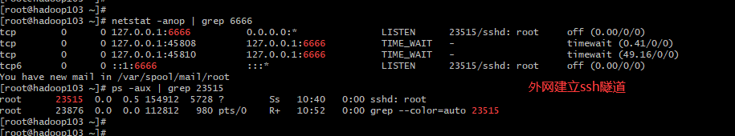

### ssh隧道技术
* 本地SSH隧道
```shell
-f 后台执行ssh指令
-C 请求压缩所有数据
-N 不执行远程指令
-g 允许远程主机连接主机的转发端口
-L 建立本地SSH隧道
-R 建立远程SSH隧道

ssh -fCNg -L 8888:远程服务器IP:22 root@远程服务器IP
# 本地电脑敲命令建立本地SSH隧道 ssh -fCNg -L 8888:192.168.182.128:22 root@192.168.182.128
# 本地电脑会自动起一个进程监听8888端口，当我们访问本地8888端口就好像访问远程22端口的服务一样
# 例如: ssh -p 8888 root@127.0.0.1
```
* 远程SSH隧道(内网穿透)
```shell
ssh -fCNg -R 9999:127.0.0.1:8888 root@远程服务器IP
# 服务器会自动起一个进程监听9999端口
# 把远程的9999端口映射到本地的8888端口上。外界访问远程服务器的9999端口相当于访问本机的8888端口
# 本地电脑敲命令建立远程SSH隧道 ssh -fCNg -R 9999:127.0.0.1:8888 root@192.168.182.128
```

### ssh本地实现远程日志采集
#### ssh无密码登录
* 检查本地服务器公钥
```txt
# cat ~/.ssh/id_rsa.pub
# 如果没有公钥执行命令
# ssh-keygen.exe -t rsa -C "描述"
```
* 将公钥传给远程服务器```ssh-copy-id root@192.168.182.128```
#### 日志采集
* 存在bug```ssh -v root@192.168.182.128 'tail -f /home/harrdy/test.txt | grep "lukang"'```
```shell
# 首先判断在哪个节点
ssh root@192.168.182.128 'tail -n2 /home/harrdy/test.txt | grep "TcpForward"'
# 根据transcationID抓取详细日志
ssh root@192.168.182.128 'cat /home/harrdy/test.txt | grep "transcationID"'
```
* 批量
```sh
#! /bin/bash
for i in 192.168.182.128 192.168.182.128
do
    echo "主机[$i]开始采集日志"
    ssh root@$i 'hostname'
    ssh root@$i 'tail -n2 /home/harrdy/test.txt | grep "TcpForward"'
done
```
```shell
#! /bin/bash
ipPrefix="192.168.182."
for i in {128..130}
do
    ip=${ipPrefix}${i}
    echo "主机[$ip]开始采集日志"
    ssh root@$ip 'hostname'
    echo "日志信息"
    ssh root@$ip 'tail -n2 /home/harrdy/test.txt | grep "TcpForward"'
done
```
