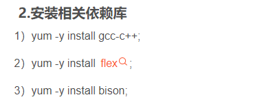

### tcpdump的安装

```txt
Linux 安装tcpdump以CentOS为例
https://www.jianshu.com/p/e5f67833ef2b

## rpm包的形式安裝  RPM包倉庫
http://rpmfind.net/linux/RPM/index.html
```
### tcpdump的使用
* tcpdump指导```https://danielmiessler.com/p/tcpdump/```
```txt
## 报错 tcpdump: 'tcp' modifier applied to host
GFree_Wind: 你的命令里少了一个and
应该是这样的：
[root@Lnx99 lb]#tcpdump tcp port 22 and host 192.168.3.155
tcpdump: verbose output suppressed, use -v or -vv for.....
是啊，少了个and。
后来看了下面的英文搞清楚原因了。
原来：
UDP/TCP doesn't know about "hosts" - that's IP's responsibility. UDP/TCP only knows about ports.
所以tcp不能做host的修饰符
```
```shell
# -i 表示监听接口
tcpdump -i ens33

# 打印经过此主机或者离开此主机的包
tcpdump -i ens33 host 主机IP
# -n 不转换端口和地址(都用数字表示)
tcpdump -i ens33 -n -v host 192.168.182.128

# 打印ping包
tcpdump -i ens33 'icmp[icmptype] == icmp-echo or icmp[icmptype] == icmp-echoreply'
# -v 详情
tcpdump -i ens33 -v 'icmp[icmptype] == icmp-echo or icmp[icmptype] == icmp-echoreply'

# 捕获主机192.168.182.128与其他主机之间（不包括www.baidu.com）通信的ip数据包
tcpdump -i ens33 -n -v ip host 192.168.182.128 and not www.baidu.com

# 捕获主机 192.168.182.128 和主机 192.168.182.1或192.168.182.211的所有通信数据包
tcpdump -i ens33 -n -v host 192.168.182.128 and 192.168.182.1 or 192.168.182.211

# 捕获主机192.168.182.128接收和发出的tcp协议的ssh的数据包
tcpdump -i ens33 -n -v tcp port 22 and host 192.168.182.128

# 抓取ens33经过的icmp协议的数据包
tcpdump -i ens33 -n -v icmp

# 抓取ens33网卡icmp协议，源地址是 192.168.182.128 数据报文
tcpdump -i ens33 -n -v icmp and src 192.168.182.128

# 写文件  拉取远程服务器文件->"scp(secure copy) root@192.168.182.128:/home/harrdy/icmp.pcap 本地路径"
tcpdump -i ens33 -n -v icmp and src 192.168.182.128 -w icmp.pcap
# 读文件
tcpdump icmp -r icmp.pcap

## 精确抓取一组TCP报文
tcpdump -i ens33 -n -v tcp and '(src 192.168.10.1 and dst 192.168.10.102 and dst port 80) or (src 192.168.10.102 and dst 192.168.10.1 and src port 80)' -w tcp.pcap

## 抓取80或者8000端口的tcp报文
tcpdump -i ens33 -n -v 'tcp port (8000 or 80)' -w tcp.pcap
```
